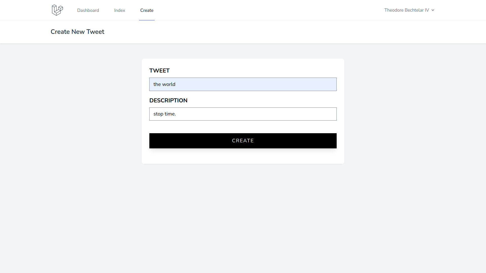
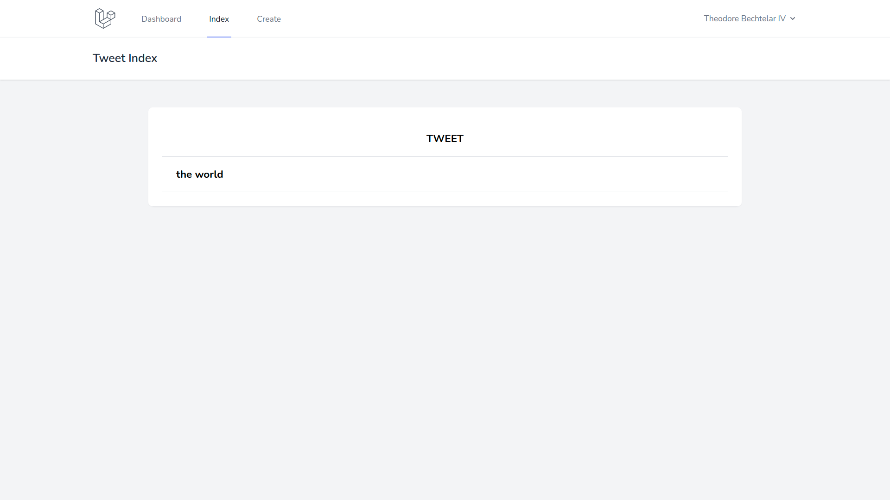
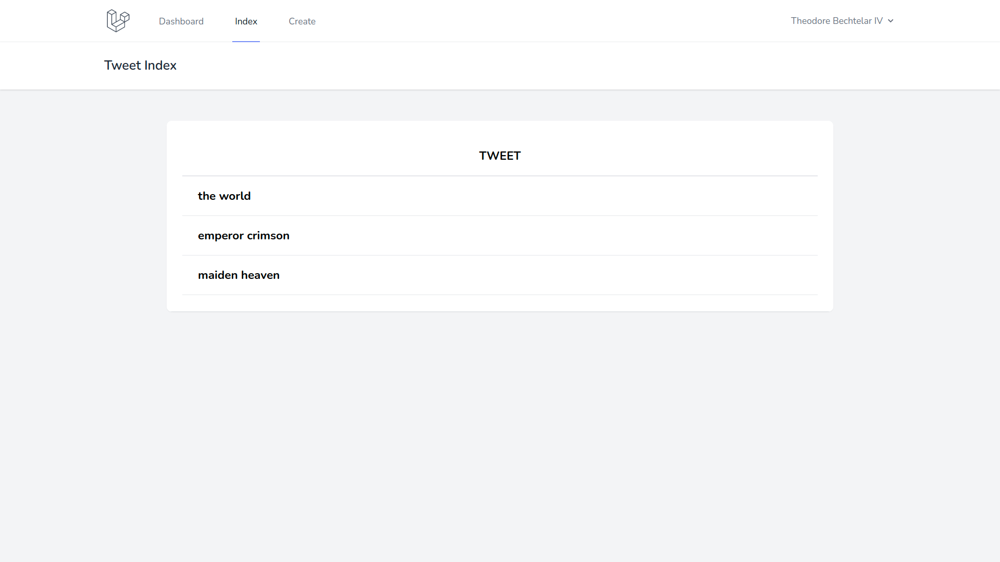

# tweet 一覧画面の実装

一覧画面では締切が早い順にソートしてデータを表示する．

### Model の処理

まず，上記の条件でデータを取得する関数を Model に作成する．

`app/Models/Tweet.php`に以下の関数を作成する．

```php
// app/Http/Models/Tweet.php

class Tweet extends Model
{
  use HasFactory;

  protected $guarded = [
    'id',
    'created_at',
    'updated_at',
  ];

  // ↓追加
  public static function getAllOrderByUpdated_at()
  {
    return self::orderBy('updated_at', 'asc')->get();
  }
}

```

> 【解説】
>
> - `self`は Tweet モデルのこと．
> - `orderBy()`は SQL のものと同じ理解で OK．
> - 最後の`get()`がないと実行されないので注意．

## Controller を編集

`app/Http/Controllers/TweetController.php`の`index()`を内容を以下のように編集する．

```php
// app/Http/Controllers/TweetController.php

public function index()
{
  // ↓編集
  $tweets = Tweet::getAllOrderByUpdated_at();
  return view('tweet.index', [
    'tweets' => $tweets
  ]);
}

```

tweet 作成画面でデータを入力して送信すると．．．



自動的に一覧画面に切り替わる．



自分が入力したデータが表示されていれば OK．何件かデータを入れておこう．


