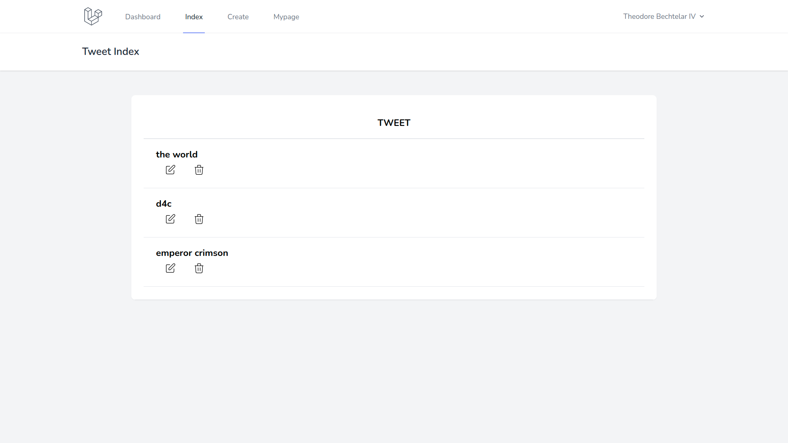
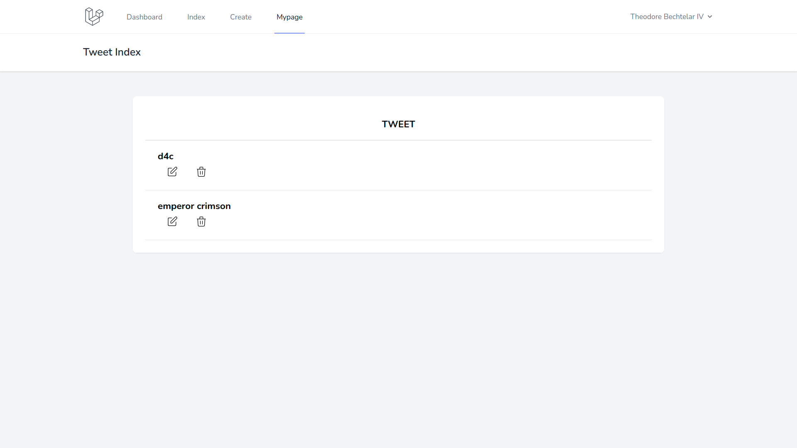

# マイページ機能の実装（1対多のデータ）

## 1対多のデータ連携

今回の場合，ユーザとtweetが「1対多」の関係となっている．

Laravelでは，このような場合に親となるデータから子のデータを取得する方法が準備されている．

`app/Models/User.php`に以下のように編集する．

```php
// app/Http/Models/User.php

class User extends Authenticatable
{
  use HasApiTokens, HasFactory, Notifiable;

  // 省略

  // ↓追加
  public function mytweets()
  {
    return $this->hasMany(Tweet::class)->orderBy('updated_at', 'desc');
  }
}

```

ここで，UserとTweetを連携させるためには，子（Tweet）のカラムに「`親_id`」（<- 今回は`user_id`）を用意しておく必要がある（前項で実施）．

これで`User`モデルを用いて，特定のユーザが投稿したtweetを取得できるようになる．

## マイページのルーティング

マイページを表示するためのルーティングを追加する．

`routes/web.php`を以下のように編集する．

```php
// routes/web.php

<?php

use Illuminate\Support\Facades\Route;
use App\Http\Controllers\TweetController;

// ↓追加
Route::get('/tweet/mypage', [TweetController::class, 'mydata'])->name('tweet.mypage');;

Route::resource('tweet', TweetController::class);

Route::get('/', function () {
  return view('welcome');
});

Route::get('/dashboard', function () {
  return view('dashboard');
})->middleware(['auth'])->name('dashboard');

require __DIR__ . '/auth.php';

```

## 特定ユーザのデータのみ取得する処理

`app/Http/Controllers/TweetController.php`の`index()`を内容を以下のように編集する．

`class TweetController extends Controller{ ... }`内の最後に`mydata()`関数を追加すればOK．

```php
// app/Http/Controllers/TweetController.php

<?php

namespace App\Http\Controllers;

use Illuminate\Http\Request;
use Validator;
use App\Models\Tweet;
use Auth;
// ↓追加
use App\Models\User;

class TweetController extends Controller
{

  // 省略

  public function mydata()
  {
    // Userモデルに定義した関数を実行する．
    $tweets = User::find(Auth::user()->id)->mytweets;
    return view('tweet.index', [
      'tweets' => $tweets
    ]);
  }
}

```

## マイページ画面の確認

マイページ自体は`index.blade.php`画面をそのまま利用するため，新たに実装する必要はない（ビューファイルにログインユーザのデータのみ渡される）．

スムーズにマイページにアクセスできるようにするため，ナビゲーション部分にリンクを追加する．

`resources/views/layouts/navigation.blade.php`の内容を以下のように編集する．

長いので全コピペ推奨．


```php
// resources/views/layouts/navigation.blade.php

<nav x-data="{ open: false }" class="bg-white border-b border-gray-100">
  <!-- Primary Navigation Menu -->
  <div class="max-w-7xl mx-auto px-4 sm:px-6 lg:px-8">
    <div class="flex justify-between h-16">
      <div class="flex">
        <!-- Logo -->
        <div class="flex-shrink-0 flex items-center">
          <a href="{{ route('dashboard') }}">
            <x-application-logo class="block h-10 w-auto fill-current text-gray-600" />
          </a>
        </div>

        <!-- Navigation Links -->
        <div class="hidden space-x-8 sm:-my-px sm:ml-10 sm:flex">
          <x-nav-link :href="route('dashboard')" :active="request()->routeIs('dashboard')">
            {{ __('Dashboard') }}
          </x-nav-link>
        </div>
        <!-- ↓一覧ページへのリンクを追加 -->
        <div class="hidden space-x-8 sm:-my-px sm:ml-10 sm:flex">
          <x-nav-link :href="route('tweet.index')" :active="request()->routeIs('tweet.index')">
            {{ __('Index') }}
          </x-nav-link>
        </div>
        <!-- ↓作成ページへのリンクを追加 -->
        <div class="hidden space-x-8 sm:-my-px sm:ml-10 sm:flex">
          <x-nav-link :href="route('tweet.create')" :active="request()->routeIs('tweet.create')">
            {{ __('Create') }}
          </x-nav-link>
        </div>
        <!-- ↓マイページへのリンクを追加 -->
        <div class="hidden space-x-8 sm:-my-px sm:ml-10 sm:flex">
          <x-nav-link :href="route('tweet.mypage')" :active="request()->routeIs('tweet.mypage')">
            {{ __('Mypage') }}
          </x-nav-link>
        </div>
      </div>

      <!-- Settings Dropdown -->
      <div class="hidden sm:flex sm:items-center sm:ml-6">
        <x-dropdown align="right" width="48">
          <x-slot name="trigger">
            <button class="flex items-center text-sm font-medium text-gray-500 hover:text-gray-700 hover:border-gray-300 focus:outline-none focus:text-gray-700 focus:border-gray-300 transition duration-150 ease-in-out">
              <div>{{ Auth::user()->name }}</div>

              <div class="ml-1">
                <svg class="fill-current h-4 w-4" xmlns="http://www.w3.org/2000/svg" viewBox="0 0 20 20">
                  <path fill-rule="evenodd" d="M5.293 7.293a1 1 0 011.414 0L10 10.586l3.293-3.293a1 1 0 111.414 1.414l-4 4a1 1 0 01-1.414 0l-4-4a1 1 0 010-1.414z" clip-rule="evenodd" />
                </svg>
              </div>
            </button>
          </x-slot>

          <x-slot name="content">
            <!-- Authentication -->
            <form method="POST" action="{{ route('logout') }}">
              @csrf

              <x-dropdown-link :href="route('logout')" onclick="event.preventDefault();
                                                this.closest('form').submit();">
                {{ __('Logout') }}
              </x-dropdown-link>
            </form>
          </x-slot>
        </x-dropdown>
      </div>

      <!-- Hamburger -->
      <div class="-mr-2 flex items-center sm:hidden">
        <button @click="open = ! open" class="inline-flex items-center justify-center p-2 rounded-md text-gray-400 hover:text-gray-500 hover:bg-gray-100 focus:outline-none focus:bg-gray-100 focus:text-gray-500 transition duration-150 ease-in-out">
          <svg class="h-6 w-6" stroke="currentColor" fill="none" viewBox="0 0 24 24">
            <path :class="{'hidden': open, 'inline-flex': ! open }" class="inline-flex" stroke-linecap="round" stroke-linejoin="round" stroke-width="2" d="M4 6h16M4 12h16M4 18h16" />
            <path :class="{'hidden': ! open, 'inline-flex': open }" class="hidden" stroke-linecap="round" stroke-linejoin="round" stroke-width="2" d="M6 18L18 6M6 6l12 12" />
          </svg>
        </button>
      </div>
    </div>
  </div>

  <!-- Responsive Navigation Menu -->
  <div :class="{'block': open, 'hidden': ! open}" class="hidden sm:hidden">
    <div class="pt-2 pb-3 space-y-1">
      <x-responsive-nav-link :href="route('dashboard')" :active="request()->routeIs('dashboard')">
        {{ __('Dashboard') }}
      </x-responsive-nav-link>
    </div>
    <!-- ↓一覧ページへのリンクを追加 -->
    <div class="pt-2 pb-3 space-y-1">
      <x-responsive-nav-link :href="route('tweet.index')" :active="request()->routeIs('tweet.index')">
        {{ __('Index') }}
      </x-responsive-nav-link>
    </div>
    <!-- ↓作成ページへのリンクを追加 -->
    <div class="pt-2 pb-3 space-y-1">
      <x-responsive-nav-link :href="route('tweet.create')" :active="request()->routeIs('tweet.create')">
        {{ __('Create') }}
      </x-responsive-nav-link>
    </div>
    <!-- ↓マイページへのリンクを追加 -->
    <div class="pt-2 pb-3 space-y-1">
      <x-responsive-nav-link :href="route('tweet.mypage')" :active="request()->routeIs('tweet.mypage')">
        {{ __('Mypage') }}
      </x-responsive-nav-link>
    </div>

    <!-- Responsive Settings Options -->
    <div class="pt-4 pb-1 border-t border-gray-200">
      <div class="flex items-center px-4">
        <div class="flex-shrink-0">
          <svg class="h-10 w-10 fill-current text-gray-400" xmlns="http://www.w3.org/2000/svg" fill="none" viewBox="0 0 24 24" stroke="currentColor">
            <path stroke-linecap="round" stroke-linejoin="round" stroke-width="2" d="M16 7a4 4 0 11-8 0 4 4 0 018 0zM12 14a7 7 0 00-7 7h14a7 7 0 00-7-7z" />
          </svg>
        </div>

        <div class="ml-3">
          <div class="font-medium text-base text-gray-800">{{ Auth::user()->name }}</div>
          <div class="font-medium text-sm text-gray-500">{{ Auth::user()->email }}</div>
        </div>
      </div>

      <div class="mt-3 space-y-1">
        <!-- Authentication -->
        <form method="POST" action="{{ route('logout') }}">
          @csrf

          <x-responsive-nav-link :href="route('logout')" onclick="event.preventDefault();
                                        this.closest('form').submit();">
            {{ __('Logout') }}
          </x-responsive-nav-link>
        </form>
      </div>
    </div>
  </div>
</nav>

```

下図のようにマイページへのリンクが表示される．



マイページを表示させ，ログインしているユーザのデータのみ表示されることを確認する．異なるユーザでログインし，個別にデータが表示されることを確認すると良いだろう．




